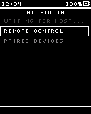
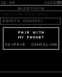
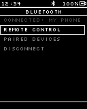
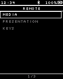
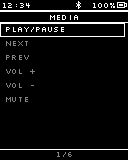
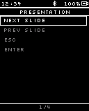
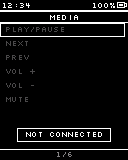
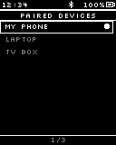
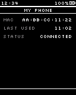
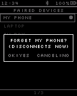

# Flow: Bluetooth-new

## States

### BT Menu (waiting)  `[screen, list input, start]`

Screen: **BT B-M0 BT Menu Waiting-new** (Mockup 128×160, id `pic104`)

> Advertising starts here; stops on leaving if nothing is connected

### Launcher (back)  `[screen, list input]`

Screen: **Main M6a Launcher-new** (Mockup 128×160, id `pic75`)

> Leave this flow: back to the Launcher

### Pair request  `[screen, normal input]`

Screen: **BT B-P Pair Request-new** (Mockup 128×160, id `pic106`)

> Known hosts connect without asking. Bond store full -> oldest removed (LRU)

### BT Menu (connected)  `[screen, list input]`

Screen: **BT B-M1 BT Menu Connected-new** (Mockup 128×160, id `pic105`)

### Remote groups  `[screen, list input]`

Screen: **BT B0 Remote Groups-new** (Mockup 128×160, id `pic107`)

> Keys group: arrows, PgUp/PgDn, Esc, Enter (same layout as Media)

### Media keys  `[screen, list input]`

Screen: **BT B1 Media Keys-new** (Mockup 128×160, id `pic108`)

### Presentation keys  `[screen, list input]`

Screen: **BT B1p Presentation Keys-new** (Mockup 128×160, id `pic109`)

### Not connected  `[screen, list input]`

Screen: **BT B1x Not Connected-new** (Mockup 128×160, id `pic110`)

### Paired Devices  `[screen, list input]`

Screen: **BT P1 Paired Devices-new** (Mockup 128×160, id `pic111`)

### Device detail  `[screen, normal input]`

Screen: **BT P2 Paired Detail-new** (Mockup 128×160, id `pic112`)

### Forget device?  `[screen, normal input]`

Screen: **BT P1d Forget Device-new** (Mockup 128×160, id `pic113`)

> Forgetting the connected host disconnects it

## Transitions

- BT Menu (waiting) —OK · tap→ Remote groups · "Remote Control"
- BT Menu (waiting) —OK · tap→ Paired Devices · "Paired Devices"
- BT Menu (waiting) —⚡ BLE pair request→ Pair request (fade, 150 ms)
- BT Menu (waiting) —⚡ BLE connected→ BT Menu (connected) · "known host"
- BT Menu (waiting) —Cancel · tap→ Launcher (back)
- Pair request —OK · tap→ BT Menu (connected) · "pair"
- Pair request —Cancel · tap→ BT Menu (waiting) · "reject"
- BT Menu (connected) —OK · tap→ Remote groups · "Remote Control"
- BT Menu (connected) —OK · tap→ Paired Devices · "Paired Devices"
- BT Menu (connected) —OK · tap→ BT Menu (waiting) · "Disconnect"
- BT Menu (connected) —⚡ BLE disconnected→ BT Menu (waiting)
- BT Menu (connected) —Cancel · tap→ Launcher (back) · "stays connected"
- Remote groups —OK · tap→ Media keys · "Media"
- Remote groups —OK · tap→ Presentation keys · "Presentation"
- Remote groups —Cancel · tap→ BT Menu (connected)
- Media keys —OK · tap→ Media keys · "send key"
- Media keys —repeat OK→ Media keys · "repeat while held"
- Media keys —Cancel · tap→ Remote groups
- Presentation keys —OK · tap→ Presentation keys · "send key"
- Presentation keys —repeat OK→ Presentation keys · "repeat while held"
- Presentation keys —Cancel · tap→ Remote groups
- Media keys —⚡ BLE disconnected→ Not connected
- Not connected —⚡ BLE connected→ Media keys
- Not connected —Cancel · tap→ Remote groups
- Paired Devices —OK · tap→ Device detail
- Paired Devices —Cancel · tap→ BT Menu (connected)
- Paired Devices —hold Cancel→ Forget device? (fade, 150 ms)
- Device detail —Cancel · tap→ Paired Devices
- Forget device? —OK · tap→ Paired Devices · "forgotten"
- Forget device? —Cancel · tap→ Paired Devices

## System events used

- `ble_pair_request`: BLE pair request
- `ble_connected`: BLE connected
- `ble_disconnected`: BLE disconnected
