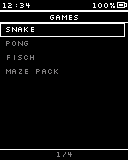
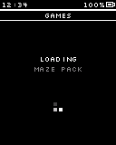
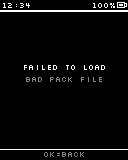
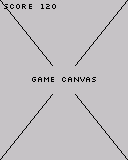
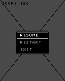
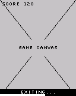

# Flow: Games-new

## States

### Games Menu  `[screen, list input, start]`

Screen: **Games G1 Games Menu-new** (Mockup 128×160, id `pic114`)

> Built-in first, then SD packs. No SD -> toast "SD not available"

### Launcher (back)  `[screen, list input]`

Screen: **Main M6a Launcher-new** (Mockup 128×160, id `pic75`)

> Leave this flow: back to the Launcher

### Loading pack  `[screen, normal input]`

Screen: **Games G2 Loading Pack-new** (Mockup 128×160, id `pic115`)

### Load failed  `[screen, normal input]`

Screen: **Games G2f Load Failed-new** (Mockup 128×160, id `pic116`)

### Game (canvas)  `[screen, normal input]`

Screen: **Games G3 Game Canvas-new** (Mockup 128×160, id `pic117`)

> Full screen, no status bar. Idle dim/sleep off. Level 0: host owns Cancel hold. Levels 1/2 (bypass list) draw their own pause.

### Pause menu (host)  `[screen, list input]`

Screen: **Games G4 Pause Menu-new** (Mockup 128×160, id `pic118`)

### Failsafe exit  `[screen, normal input]`

Screen: **Games G5 Failsafe Exit-new** (Mockup 128×160, id `pic119`)

> Works at every level; progress bar from 1.5 s

## Transitions

- Games Menu —OK · tap→ Game (canvas) · "built-in game"
- Games Menu —OK · tap→ Loading pack · "SD pack"
- Games Menu —Cancel · tap→ Launcher (back)
- Loading pack —⚡ Game pack loaded→ Game (canvas)
- Loading pack —⚡ Game pack failed→ Load failed
- Load failed —OK · tap→ Games Menu
- Game (canvas) —hold Cancel→ Pause menu (host) (fade, 150 ms) · "level 0 only"
- Game (canvas) —⚡ App failsafe exit (Cancel held 3 s)→ Failsafe exit
- Pause menu (host) —OK · tap→ Game (canvas) · "Resume"
- Pause menu (host) —OK · tap→ Game (canvas) · "Restart"
- Pause menu (host) —OK · tap→ Games Menu · "Exit (game saves in onExit)"
- Pause menu (host) —Cancel · tap→ Game (canvas) · "Resume"
- Failsafe exit —⏱ 0.5 s→ Games Menu

## System events used

- `pack_loaded`: Game pack loaded
- `pack_failed`: Game pack failed
- `app_failsafe`: App failsafe exit (Cancel held 3 s)
