# Flow: IR-new

## States

### IR Menu  `[screen, list input, start]`

Screen: **IR I0 IR Menu-new** (Mockup 128×160, id `pic40`)

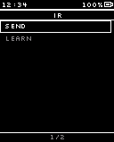

### Launcher (back)  `[screen, list input]`

Screen: **Main M6a Launcher-new** (Mockup 128×160, id `pic75`)

> Leave this flow: back to the Launcher

### Any categories?  `[internal]`

### Send: categories  `[screen, list input]`

Screen: **IR S1 Send Categories-new** (Mockup 128×160, id `pic41`)

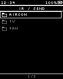

> Cancel hold opens the category menu (rename/delete).

### Send: no categories  `[screen, list input]`

Screen: **IR S1-0 Send Categories Empty-new** (Mockup 128×160, id `pic42`)

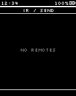

### Category menu  `[screen, list input]`

Screen: **IR S1a Category Menu-new** (Mockup 128×160, id `pic43`)

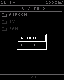

### Rename category  `[screen, text input]`

Screen: **IR S1b Rename Category-new** (Mockup 128×160, id `pic44`)

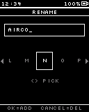

> Name already exists -> message, keep editing

### Delete category?  `[screen, normal input]`

Screen: **IR S1c Delete Category-new** (Mockup 128×160, id `pic45`)

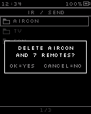

> Deletes every signal inside too; empty category shows "Delete <name>?"

### Category has signals?  `[internal]`

### Send: signals  `[screen, list input]`

Screen: **IR S2 Send Signals-new** (Mockup 128×160, id `pic46`)

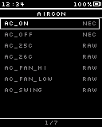

### Signals: empty  `[screen, list input]`

Screen: **IR S2-0 Signals Empty-new** (Mockup 128×160, id `pic47`)

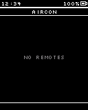

### Signal sent  `[screen, normal input]`

Screen: **IR S2t Signal Sent-new** (Mockup 128×160, id `pic48`)

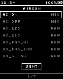

> Toast + confirm beep, stays on the list

### Delete signal?  `[screen, normal input]`

Screen: **IR S3 Delete Signal-new** (Mockup 128×160, id `pic49`)

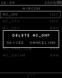

### Learn: waiting  `[screen, normal input]`

Screen: **IR L1 Learn Waiting-new** (Mockup 128×160, id `pic50`)

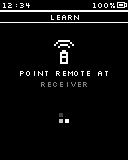

> RMT RX on only while here; timeout ~15 s

### Protocol decoded?  `[internal]`

### Learn: no signal  `[screen, normal input]`

Screen: **IR L1b Learn No Signal-new** (Mockup 128×160, id `pic51`)

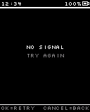

### Captured (decoded)  `[screen, normal input]`

Screen: **IR L2a Captured Decoded-new** (Mockup 128×160, id `pic52`)

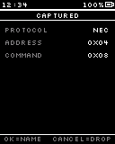

### Captured (RAW)  `[screen, normal input]`

Screen: **IR L2b Captured Raw-new** (Mockup 128×160, id `pic53`)

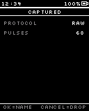

### Name the signal  `[screen, text input]`

Screen: **IR L3 Name Signal-new** (Mockup 128×160, id `pic54`)

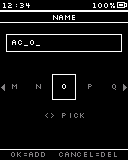

### Pick category  `[screen, list input]`

Screen: **IR L4 Pick Category-new** (Mockup 128×160, id `pic55`)

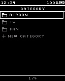

### New category name  `[screen, text input]`

Screen: **Tpl TP1 Text Input-new** (Mockup 128×160, id `pic141`)

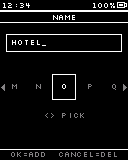

### Saved  `[screen, normal input]`

Screen: **IR L5 Saved-new** (Mockup 128×160, id `pic56`)

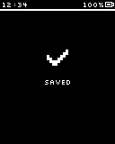

## Transitions

- IR Menu —OK · tap→ Any categories? · "Send"
- IR Menu —OK · tap→ Learn: waiting · "Learn"
- IR Menu —Cancel · tap→ Launcher (back)
- Any categories? —= yes→ Send: categories
- Any categories? —= no→ Send: no categories
- Send: no categories —Cancel · tap→ IR Menu
- Send: categories —OK · tap→ Category has signals?
- Send: categories —Cancel · tap→ IR Menu
- Send: categories —hold Cancel→ Category menu (fade, 150 ms)
- Category menu —OK · tap→ Rename category · "Rename"
- Category menu —OK · tap→ Delete category? · "Delete"
- Category menu —Cancel · tap→ Send: categories
- Rename category —OK · tap→ Send: categories · "OK on the check slot: save"
- Rename category —hold Cancel→ Send: categories · "cancel rename"
- Delete category? —OK · tap→ Send: categories · "deleted"
- Delete category? —Cancel · tap→ Send: categories
- Category has signals? —= yes→ Send: signals
- Category has signals? —= no→ Signals: empty
- Signals: empty —Cancel · tap→ Send: categories
- Send: signals —OK · tap→ Signal sent · "send now"
- Send: signals —Cancel · tap→ Send: categories
- Send: signals —hold Cancel→ Delete signal? (fade, 150 ms)
- Signal sent —⏱ 1 s→ Send: signals
- Delete signal? —OK · tap→ Send: signals · "deleted"
- Delete signal? —Cancel · tap→ Send: signals
- Learn: waiting —⚡ IR signal received→ Protocol decoded?
- Learn: waiting —⚡ IR learn timeout→ Learn: no signal
- Learn: waiting —Cancel · tap→ IR Menu · "RX off"
- Protocol decoded? —= yes→ Captured (decoded)
- Protocol decoded? —= no (RAW)→ Captured (RAW)
- Learn: no signal —OK · tap→ Learn: waiting · "retry"
- Learn: no signal —Cancel · tap→ IR Menu
- Captured (decoded) —OK · tap→ Name the signal
- Captured (decoded) —Cancel · tap→ Learn: waiting · "discard"
- Captured (RAW) —OK · tap→ Name the signal
- Captured (RAW) —Cancel · tap→ Learn: waiting · "discard"
- Name the signal —OK · tap→ Pick category · "OK on the check slot"
- Name the signal —hold Cancel→ Learn: waiting · "cancel: discard signal"
- Pick category —OK · tap→ Saved · "existing category"
- Pick category —OK · tap→ New category name · "New category"
- Pick category —Cancel · tap→ Name the signal
- New category name —OK · tap→ Saved · "OK on the check slot"
- New category name —hold Cancel→ Pick category
- Saved —⏱ 1.2 s→ Learn: waiting · "learn the next button"

## System events used

- `ir_received`: IR signal received
- `ir_learn_timeout`: IR learn timeout
