# Flow: Main-new

## States

### Boot status (POST)  `[screen, normal input, start]`

Screen: **Main M1 Boot Status-new** (Mockup 128×160, id `pic69`)

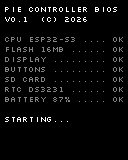

> Self-check like an old PC POST. Ignores buttons except the emergency entry.

### Boot logo + loading  `[screen, normal input]`

Screen: **Boot Load** (Mockup 128×160, id `pic18`)

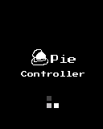

> Shown 1-5 s on purpose (real boot is fast). Earlier note: fade to black before the next screen.

### PIN set?  `[internal]`

### Lock screen (no PIN)  `[screen, normal input]`

Screen: **Main M3a Lock Screen-new** (Mockup 128×160, id `pic70`)

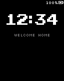

### Lock screen (PIN)  `[screen, normal input]`

Screen: **Main M3b Lock Screen PIN-new** (Mockup 128×160, id `pic71`)

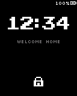

### Enter PIN  `[screen, normal input]`

Screen: **Main M4a PIN Entry-new** (Mockup 128×160, id `pic72`)

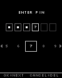

> < > turn the digit, OK confirms a digit, Cancel deletes. 6 digits, checked automatically.

### PIN correct?  `[internal]`

> 3 wrong tries -> lockout (time stacks, numbers TBD)

### Wrong PIN  `[screen, normal input]`

Screen: **Main M4b PIN Wrong-new** (Mockup 128×160, id `pic73`)

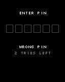

### Locked out  `[screen, normal input]`

Screen: **Main M4c Locked Out-new** (Mockup 128×160, id `pic74`)

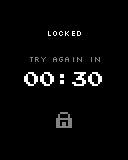

### Home Screen  `[screen, normal input]`

Screen: **Main menu mini** (Mockup 128×160, id `pic22`)

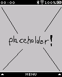

> Only Cancel does something here.

### Launcher  `[screen, list input]`

Screen: **Main M6a Launcher-new** (Mockup 128×160, id `pic75`)

> Long names use marquee when selected.

### Launcher (scrolled to end)  `[screen, list input]`

Screen: **Main M6b Launcher Scrolled-new** (Mockup 128×160, id `pic76`)

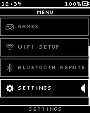

### Open selected module  `[internal]`

> Continues in that module's flow: IR-new, NFC-new, Games-new, WiFi-new, Bluetooth-new, Settings-new

### Emergency menu  `[screen, list input]`

Screen: **Main M7a Emergency Menu-new** (Mockup 128×160, id `pic77`)

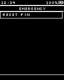

### Emergency code (8 digits)  `[screen, normal input]`

Screen: **Main M7b Emergency Code-new** (Mockup 128×160, id `pic78`)

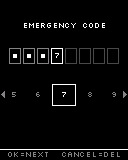

### Emergency code correct?  `[internal]`

> Wrong tries count together with the Lock screen counter

## Transitions

- Boot status (POST) —⚡ Boot checks done→ Boot logo + loading
- Boot status (POST) —hold Power→ Emergency menu · "Emergency entry" · Or a special button combo (not decided yet)
- Boot logo + loading —⏱ 3 s→ PIN set? (fade, 400 ms, ease in-out)
- PIN set? —= yes→ Lock screen (PIN)
- PIN set? —= no→ Lock screen (no PIN)
- Lock screen (no PIN) —OK · tap→ Home Screen (fade, 150 ms)
- Lock screen (PIN) —OK · tap→ Enter PIN
- Enter PIN —OK · tap→ PIN correct? · "OK on the 6th digit"
- Enter PIN —hold Cancel→ Lock screen (PIN) · "Cancel hold: back"
- PIN correct? —= correct→ Home Screen (fade, 150 ms)
- PIN correct? —= wrong, tries left→ Wrong PIN
- PIN correct? —= wrong, no tries left→ Locked out
- Wrong PIN —⏱ 1.5 s→ Enter PIN
- Locked out —⚡ Lockout over→ Lock screen (PIN)
- Home Screen —Cancel · tap→ Launcher (slide up, 250 ms) · "Menu tab slides up"
- Launcher —Cancel · tap→ Home Screen (slide down, 250 ms) · "Menu tab slides down"
- Launcher —no trigger→ Launcher (scrolled to end) · "scroll with < > (built-in list nav)"
- Launcher (scrolled to end) —Cancel · tap→ Home Screen (slide down, 250 ms)
- Launcher —OK · tap→ Open selected module
- Launcher (scrolled to end) —OK · tap→ Open selected module
- Emergency menu —OK · tap→ Emergency code (8 digits) · "Reset PIN"
- Emergency menu —Cancel · tap→ Boot logo + loading · "Leave: continue booting"
- Emergency code (8 digits) —OK · tap→ Emergency code correct? · "OK on the 8th digit"
- Emergency code (8 digits) —hold Cancel→ Emergency menu
- Emergency code correct? —= correct: PIN removed, continue boot→ Boot logo + loading
- Emergency code correct? —= wrong→ Emergency code (8 digits)
- Emergency code correct? —= too many wrong→ Locked out

## System events used

- `boot_done`: Boot checks done
- `lockout_over`: Lockout over
