# Flow: NFC-new

## States

### NFC Menu  `[screen, list input, start]`

Screen: **NFC N0 NFC Menu-new** (Mockup 128×160, id `pic79`)

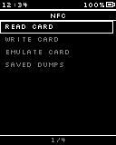

> PN532 starts here; no answer -> "NFC module not found"

### Launcher (back)  `[screen, list input]`

Screen: **Main M6a Launcher-new** (Mockup 128×160, id `pic75`)

> Leave this flow: back to the Launcher

### Read: place card  `[screen, normal input]`

Screen: **NFC R1 Read Waiting-new** (Mockup 128×160, id `pic80`)

### Reading  `[screen, normal input]`

Screen: **NFC R2 Reading-new** (Mockup 128×160, id `pic81`)

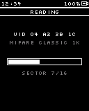

### Read result  `[screen, normal input]`

Screen: **NFC R3 Read Result-new** (Mockup 128×160, id `pic82`)

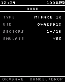

### Name the dump  `[screen, text input]`

Screen: **Tpl TP1 Text Input-new** (Mockup 128×160, id `pic141`)

### Saved  `[screen, normal input]`

Screen: **IR L5 Saved-new** (Mockup 128×160, id `pic56`)

### Write: pick dump  `[screen, list input]`

Screen: **NFC W1 Write Pick Dump-new** (Mockup 128×160, id `pic83`)

### Write: confirm  `[screen, normal input]`

Screen: **NFC W2 Write Confirm-new** (Mockup 128×160, id `pic84`)

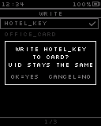

### Write: place card  `[screen, normal input]`

Screen: **NFC W3 Write Waiting-new** (Mockup 128×160, id `pic85`)

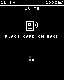

### Card type matches?  `[internal]`

### Writing  `[screen, normal input]`

Screen: **NFC W4 Writing-new** (Mockup 128×160, id `pic86`)

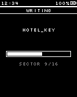

### Write done  `[screen, normal input]`

Screen: **NFC W5a Write Done-new** (Mockup 128×160, id `pic87`)

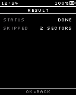

### Type mismatch  `[screen, normal input]`

Screen: **NFC W5b Write Type Mismatch-new** (Mockup 128×160, id `pic88`)

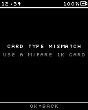

### Emulate: pick dump  `[screen, list input]`

Screen: **NFC E1 Emulate Pick Dump-new** (Mockup 128×160, id `pic89`)

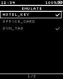

### Dump emulatable?  `[internal]`

### Cannot emulate  `[screen, normal input]`

Screen: **NFC E1p Cannot Emulate-new** (Mockup 128×160, id `pic90`)

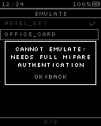

### Emulating  `[screen, normal input]`

Screen: **NFC E2 Emulating-new** (Mockup 128×160, id `pic91`)

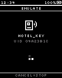

> Idle sleep paused while emulating

### Saved Dumps  `[screen, list input]`

Screen: **NFC D1 Saved Dumps-new** (Mockup 128×160, id `pic92`)

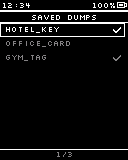

### Delete dump?  `[screen, normal input]`

Screen: **NFC D1d Delete Dump-new** (Mockup 128×160, id `pic93`)

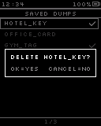

### Dump detail  `[screen, normal input]`

Screen: **NFC D2 Dump Detail-new** (Mockup 128×160, id `pic94`)

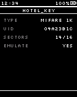

## Transitions

- NFC Menu —OK · tap→ Read: place card · "Read Card"
- NFC Menu —OK · tap→ Write: pick dump · "Write Card"
- NFC Menu —OK · tap→ Emulate: pick dump · "Emulate Card"
- NFC Menu —OK · tap→ Saved Dumps · "Saved Dumps"
- NFC Menu —Cancel · tap→ Launcher (back)
- Read: place card —⚡ NFC card found→ Reading
- Read: place card —Cancel · tap→ NFC Menu
- Reading —⚡ NFC read done→ Read result
- Reading —⚡ NFC card lost→ Read: place card · "card lost: try again"
- Reading —Cancel · tap→ Read: place card · "stop"
- Read result —OK · tap→ Name the dump
- Read result —Cancel · tap→ Read: place card · "discard"
- Name the dump —OK · tap→ Saved · "OK on the check slot"
- Name the dump —hold Cancel→ Read result
- Saved —⏱ 1.2 s→ Read: place card · "read the next card"
- Write: pick dump —OK · tap→ Write: confirm (fade, 150 ms)
- Write: pick dump —Cancel · tap→ NFC Menu
- Write: confirm —OK · tap→ Write: place card
- Write: confirm —Cancel · tap→ Write: pick dump
- Write: place card —⚡ NFC card found→ Card type matches?
- Write: place card —Cancel · tap→ Write: pick dump
- Card type matches? —= yes→ Writing
- Card type matches? —= no→ Type mismatch
- Writing —⚡ NFC write done→ Write done
- Writing —Cancel · tap→ Write done · "stop (shows sectors written)"
- Write done —OK · tap→ Write: pick dump
- Type mismatch —OK · tap→ Write: pick dump
- Emulate: pick dump —OK · tap→ Dump emulatable?
- Emulate: pick dump —Cancel · tap→ NFC Menu
- Dump emulatable? —= yes→ Emulating
- Dump emulatable? —= no→ Cannot emulate (fade, 150 ms)
- Cannot emulate —OK · tap→ Emulate: pick dump
- Emulating —Cancel · tap→ Emulate: pick dump · "stop"
- Saved Dumps —OK · tap→ Dump detail
- Saved Dumps —Cancel · tap→ NFC Menu
- Saved Dumps —hold Cancel→ Delete dump? (fade, 150 ms)
- Delete dump? —OK · tap→ Saved Dumps · "deleted"
- Delete dump? —Cancel · tap→ Saved Dumps
- Dump detail —Cancel · tap→ Saved Dumps

## System events used

- `nfc_card_found`: NFC card found
- `nfc_read_done`: NFC read done
- `nfc_card_lost`: NFC card lost
- `nfc_write_done`: NFC write done
