# Flow: Settings-new

## States

### Settings Menu  `[screen, list input, start]`

Screen: **Settings T0 Settings Menu-new** (Mockup 128×160, id `pic120`)

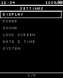

### Launcher (back)  `[screen, list input]`

Screen: **Main M6a Launcher-new** (Mockup 128×160, id `pic75`)

> Leave this flow: back to the Launcher

### Display  `[screen, list input]`

Screen: **Settings T1 Display-new** (Mockup 128×160, id `pic121`)

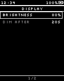

### Display: editing  `[screen, normal input]`

Screen: **Settings T1e Display Editing-new** (Mockup 128×160, id `pic122`)

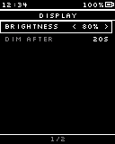

> < > adjust, hold to speed up

### Power  `[screen, list input]`

Screen: **Settings T2 Power-new** (Mockup 128×160, id `pic123`)

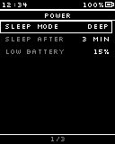

> Sleep after hides when Never is chosen; numbers edit in the row like T1e

### Sleep mode  `[screen, list input]`

Screen: **Settings T2p Sleep Mode Picker-new** (Mockup 128×160, id `pic124`)

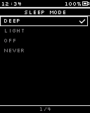

### Sound  `[screen, list input]`

Screen: **Settings T3 Sound-new** (Mockup 128×160, id `pic125`)

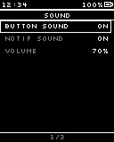

> Toggles flip on OK; Volume edits in the row

### PIN set?  `[internal]`

### Lock Screen (no PIN)  `[screen, list input]`

Screen: **Settings K1a Lock No PIN-new** (Mockup 128×160, id `pic126`)

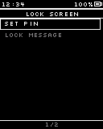

### Lock Screen (PIN)  `[screen, list input]`

Screen: **Settings K1b Lock With PIN-new** (Mockup 128×160, id `pic127`)

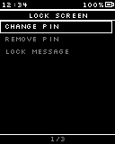

### New PIN  `[screen, normal input]`

Screen: **Settings K3a New PIN-new** (Mockup 128×160, id `pic128`)

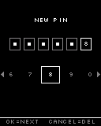

### Confirm PIN  `[screen, normal input]`

Screen: **Settings K3b Confirm PIN-new** (Mockup 128×160, id `pic129`)

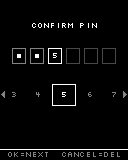

### PINs match?  `[internal]`

### PINs do not match  `[screen, normal input]`

Screen: **Settings K3c PIN Mismatch-new** (Mockup 128×160, id `pic130`)

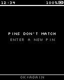

### Current PIN (to change)  `[screen, normal input]`

Screen: **Main M4a PIN Entry-new** (Mockup 128×160, id `pic72`)

### Current PIN correct?  `[internal]`

> Wrong tries count with the Lock screen counter

### Current PIN (to remove)  `[screen, normal input]`

Screen: **Main M4a PIN Entry-new** (Mockup 128×160, id `pic72`)

### Current PIN correct?  `[internal]`

### Remove PIN?  `[screen, normal input]`

Screen: **Settings K5 Remove PIN-new** (Mockup 128×160, id `pic131`)

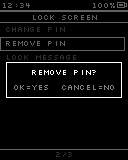

### Lock message  `[screen, text input]`

Screen: **Settings K6 Lock Message-new** (Mockup 128×160, id `pic132`)

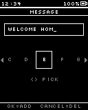

> Can be empty; length limit TBD

### Date & Time  `[screen, list input]`

Screen: **Settings D0 Date Time-new** (Mockup 128×160, id `pic133`)

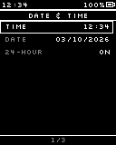

### Editing time  `[screen, normal input]`

Screen: **Settings D0e Time Editing-new** (Mockup 128×160, id `pic134`)

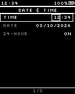

> OK moves to the next field

### System  `[screen, list input]`

Screen: **Settings Y1 System-new** (Mockup 128×160, id `pic135`)

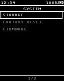

### Storage  `[screen, normal input]`

Screen: **Settings Y2 Storage-new** (Mockup 128×160, id `pic136`)

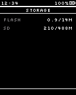

### Firmware  `[screen, normal input]`

Screen: **Settings Y6 Firmware-new** (Mockup 128×160, id `pic140`)

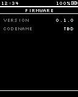

### Reset scope  `[screen, list input]`

Screen: **Settings Y3 Reset Scope-new** (Mockup 128×160, id `pic137`)

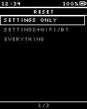

### Emergency code  `[screen, normal input]`

Screen: **Settings Y4 Reset Code-new** (Mockup 128×160, id `pic138`)

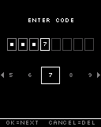

> Always required, every scope

### Code correct?  `[internal]`

> Wrong tries count with the Lock screen counter

### Confirm reset  `[screen, normal input]`

Screen: **Settings Y5 Reset Confirm-new** (Mockup 128×160, id `pic139`)

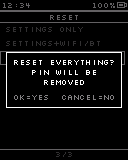

### Reset the chosen scope and reboot  `[internal]`

> SD files are kept

## Transitions

- Settings Menu —OK · tap→ Display · "Display"
- Settings Menu —OK · tap→ Power · "Power"
- Settings Menu —OK · tap→ Sound · "Sound"
- Settings Menu —OK · tap→ PIN set? · "Lock Screen"
- Settings Menu —OK · tap→ Date & Time · "Date & Time"
- Settings Menu —OK · tap→ System · "System"
- Settings Menu —Cancel · tap→ Launcher (back)
- Display —OK · tap→ Display: editing
- Display —Cancel · tap→ Settings Menu
- Display: editing —OK · tap→ Display · "save"
- Display: editing —Cancel · tap→ Display · "restore old value"
- Power —OK · tap→ Sleep mode · "Sleep mode"
- Power —Cancel · tap→ Settings Menu
- Sleep mode —OK · tap→ Power · "chosen"
- Sleep mode —Cancel · tap→ Power
- Sound —OK · tap→ Sound · "toggle"
- Sound —Cancel · tap→ Settings Menu
- PIN set? —= yes→ Lock Screen (PIN)
- PIN set? —= no→ Lock Screen (no PIN)
- Lock Screen (no PIN) —OK · tap→ New PIN · "Set PIN"
- Lock Screen (no PIN) —OK · tap→ Lock message · "Lock message"
- Lock Screen (no PIN) —Cancel · tap→ Settings Menu
- Lock Screen (PIN) —OK · tap→ Current PIN (to change) · "Change PIN"
- Lock Screen (PIN) —OK · tap→ Current PIN (to remove) · "Remove PIN"
- Lock Screen (PIN) —OK · tap→ Lock message · "Lock message"
- Lock Screen (PIN) —Cancel · tap→ Settings Menu
- New PIN —OK · tap→ Confirm PIN · "OK on the 6th digit"
- New PIN —hold Cancel→ Lock Screen (no PIN)
- Confirm PIN —OK · tap→ PINs match? · "OK on the 6th digit"
- Confirm PIN —hold Cancel→ New PIN
- PINs match? —= yes: "PIN set"→ Lock Screen (PIN)
- PINs match? —= no→ PINs do not match
- PINs do not match —OK · tap→ New PIN
- Current PIN (to change) —OK · tap→ Current PIN correct? · "OK on the 6th digit"
- Current PIN (to change) —hold Cancel→ Lock Screen (PIN)
- Current PIN correct? —= yes→ New PIN
- Current PIN correct? —= no→ Current PIN (to change)
- Current PIN (to remove) —OK · tap→ Current PIN correct? · "OK on the 6th digit"
- Current PIN (to remove) —hold Cancel→ Lock Screen (PIN)
- Current PIN correct? —= yes→ Remove PIN? (fade, 150 ms)
- Current PIN correct? —= no→ Current PIN (to remove)
- Remove PIN? —OK · tap→ Lock Screen (no PIN) · ""PIN removed""
- Remove PIN? —Cancel · tap→ Lock Screen (PIN)
- Lock message —OK · tap→ Lock Screen (no PIN) · "saved (came from no-PIN page)"
- Lock message —OK · tap→ Lock Screen (PIN) · "saved (came from PIN page)"
- Lock message —hold Cancel→ Lock Screen (no PIN) · "cancel (no-PIN page)"
- Lock message —hold Cancel→ Lock Screen (PIN) · "cancel (PIN page)"
- Date & Time —OK · tap→ Editing time
- Date & Time —Cancel · tap→ Settings Menu
- Editing time —OK · tap→ Date & Time · "last field: saved to DS3231"
- Editing time —Cancel · tap→ Date & Time
- System —OK · tap→ Storage · "Storage"
- System —OK · tap→ Reset scope · "Factory Reset"
- System —OK · tap→ Firmware · "Firmware"
- System —Cancel · tap→ Settings Menu
- Storage —Cancel · tap→ System
- Firmware —Cancel · tap→ System
- Reset scope —OK · tap→ Emergency code · "scope chosen"
- Reset scope —Cancel · tap→ System
- Emergency code —OK · tap→ Code correct? · "OK on the 8th digit"
- Emergency code —hold Cancel→ Reset scope
- Code correct? —= yes→ Confirm reset (fade, 150 ms)
- Code correct? —= no→ Emergency code
- Confirm reset —OK · tap→ Reset the chosen scope and reboot
- Confirm reset —Cancel · tap→ Reset scope
