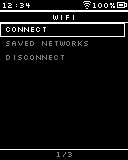
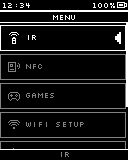
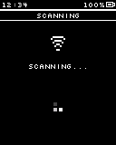
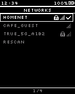
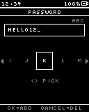
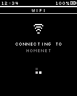
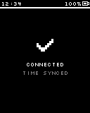
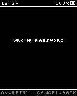
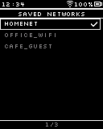
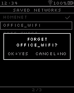

# Flow: WiFi-new

## States

### WiFi Menu  `[screen, list input, start]`

Screen: **WiFi F0 WiFi Menu-new** (Mockup 128×160, id `pic95`)

> Disconnect row only while connected. WiFi never connects at boot or drops on leaving.

### Launcher (back)  `[screen, list input]`

Screen: **Main M6a Launcher-new** (Mockup 128×160, id `pic75`)

> Leave this flow: back to the Launcher

### Scanning  `[screen, normal input]`

Screen: **WiFi C1 Scanning-new** (Mockup 128×160, id `pic96`)

### Networks  `[screen, list input]`

Screen: **WiFi C2 Networks-new** (Mockup 128×160, id `pic97`)

### Saved or open network?  `[internal]`

### Password  `[screen, text input]`

Screen: **WiFi C4 Password-new** (Mockup 128×160, id `pic98`)

> Starts empty. Hold OK switches case.

### Connecting  `[screen, normal input]`

Screen: **WiFi C5 Connecting-new** (Mockup 128×160, id `pic99`)

> Timeout ~15 s

### Connected  `[screen, normal input]`

Screen: **WiFi C6a Connected-new** (Mockup 128×160, id `pic100`)

> Saves the password now; NTP sync writes time to the DS3231

### Connect failed  `[screen, normal input]`

Screen: **WiFi C6b Connect Failed-new** (Mockup 128×160, id `pic101`)

### Saved Networks  `[screen, list input]`

Screen: **WiFi N1 Saved Networks-new** (Mockup 128×160, id `pic102`)

### Forget network?  `[screen, normal input]`

Screen: **WiFi N1d Forget Network-new** (Mockup 128×160, id `pic103`)

> Does not drop the current connection

## Transitions

- WiFi Menu —OK · tap→ Scanning · "Connect"
- WiFi Menu —OK · tap→ Saved Networks · "Saved Networks"
- WiFi Menu —OK · tap→ WiFi Menu · "Disconnect (drops at once, toast)"
- WiFi Menu —Cancel · tap→ Launcher (back)
- Scanning —⚡ WiFi scan done→ Networks
- Scanning —Cancel · tap→ WiFi Menu
- Networks —OK · tap→ Scanning · "Rescan"
- Networks —OK · tap→ Saved or open network? · "a network"
- Networks —Cancel · tap→ WiFi Menu
- Saved or open network? —= yes→ Connecting
- Saved or open network? —= no: needs a password→ Password
- Password —OK · tap→ Connecting · "OK on the check slot"
- Password —hold Cancel→ Networks
- Connecting —⚡ WiFi connected→ Connected
- Connecting —⚡ WiFi connect failed→ Connect failed
- Connecting —Cancel · tap→ Networks
- Connected —⏱ 1.5 s→ WiFi Menu
- Connect failed —OK · tap→ Password · "retry password"
- Connect failed —Cancel · tap→ Networks
- Saved Networks —OK · tap→ Connecting · "connect with saved password"
- Saved Networks —Cancel · tap→ WiFi Menu
- Saved Networks —hold Cancel→ Forget network? (fade, 150 ms)
- Forget network? —OK · tap→ Saved Networks · "forgotten"
- Forget network? —Cancel · tap→ Saved Networks

## System events used

- `wifi_scan_done`: WiFi scan done
- `wifi_connected`: WiFi connected
- `wifi_connect_failed`: WiFi connect failed
